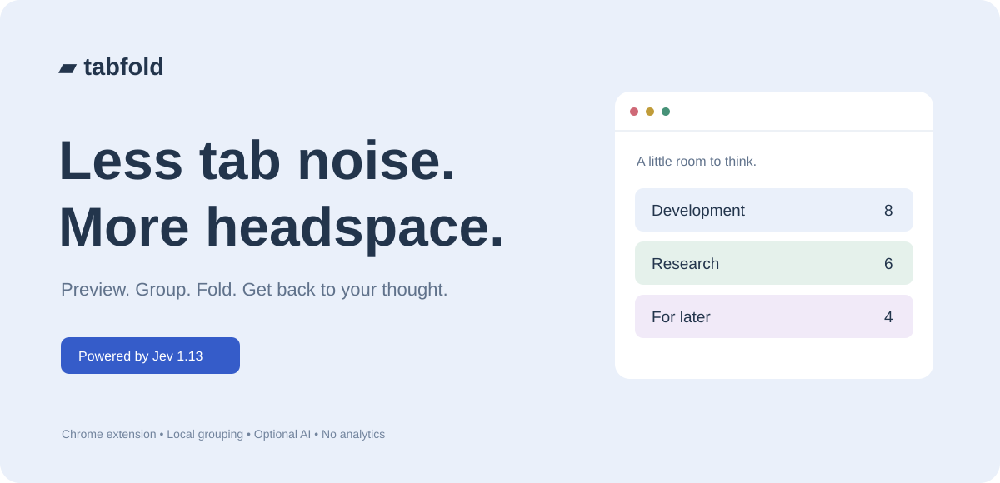
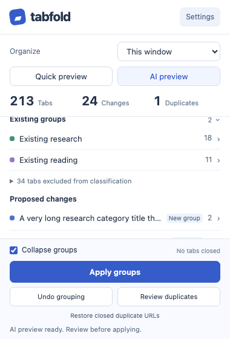

<div align="center">

# Tabfold

**タブをすっきり。思考にゆとりを。**

混み合った Chrome ウィンドウを、折りたためるタブグループに整理します。**変更する前にプレビューで確認できます。**

**プレビュー → 確認 → 適用**

Chrome Manifest V3 · ローカル優先 · Jev 1.13 · 実行時の依存関係なし

[English](../README.md) · [Français](README.fr.md) · [한국어](README.ko.md) · [简体中文](README.zh-CN.md) · [繁體中文](README.zh-TW.md) · [Русский](README.ru.md) · [日本語](README.ja.md) · [Türkçe](README.tr.md) · [Español](README.es.md)



</div>

## Tabfold を選ぶ理由

- **まずプレビュー** — タブを変更する前に、提案されたグループを確認できます。
- **AI なしでも動作** — API キーなしで、タイトル・ドメインに基づくローカルルールですぐに整理できます。
- **必要なときだけ AI** — OpenRouter または TypeSafe 経由で Jev を使い、より細かく分類できます。
- **作業の流れを維持** — タブは元のウィンドウに残し、グループを折りたたんで見やすくします。
- **標準で保護** — 固定タブ、音声再生中のタブ、シークレットタブ、内部ページ、グループ化済みのタブを保護します。
- **簡単に復元** — 最後のグループ化を元に戻し、重複整理で削除した URL を復元できます。



## 使い方

1. ローカルルールまたは AI で**プレビュー**します。
2. 提案されたグループを**確認**します。
3. 結果に問題がなければ**適用**します。

これだけです。Tabfold はウィンドウを統合したりページを置き換えたりせず、タブをグループ化して折りたたみます。

AI を実行する前から既存のグループを確認できます。AI はグループ名とサンプルタブのタイトル・URL パスを参考に、同じウィンドウの既存グループを優先します。一致する未グループ化タブを既存グループに追加し、それ以外は新しいグループにまとめます。既存のメンバー、名前、色、折りたたみ状態は変更しません。元に戻す操作では、既存グループから Tabfold が追加したタブだけを取り除きます。サンプルのタイトルと URL パスは選択した AI プロバイダーに送信されます。

## インストール

1. このリポジトリをダウンロードまたはクローンします。
2. `chrome://extensions` を開きます。
3. **デベロッパー モード**を有効にします。
4. **パッケージ化されていない拡張機能を読み込む**をクリックし、`extension` フォルダーを選びます。
5. ツールバーに **Tabfold** を固定します。

ビルドやパッケージのインストールは不要です。

## 自分に合わせて設定

**設定**では、次の操作ができます。

- 最大 **12 個のカスタムカテゴリー**を作成
- タブの並び順を**現在の順序 / タイトル / 最後に使った日時が古い順**から選択
- 新しいトピックの提案を確認して追加
- カテゴリーを JSON でインポート・エクスポート
- 英語、フランス語、韓国語、簡体字中国語、繁体字中国語、ロシア語、日本語、トルコ語、スペイン語に切り替え

「その他」は自動的に処理されます。

## AI は任意

ローカルプレビューは、すべてブラウザ内で処理されます。

AI プレビューを使うには、**設定 → AI 接続**で **OpenRouter** または **TypeSafe** を選び、そのプロバイダーの API キーを入力します。

- OpenRouter は **Decisions API** を使用します。
- TypeSafe は **Jev 1.13** を使用します。
- API キーは Chrome の**セッションストレージ**に保存され、ブラウザを閉じると削除されます。
- **別のプロバイダーへの自動切り替えはありません。**

## プライバシー

| | |
|---|---|
| **ローカルプレビュー** | 外部送信なし |
| **AI プレビュー** | タブのタイトル、URL のオリジン・パス、カテゴリーの分類基準を送信 |
| **送信しない情報** | ページ本文、URL の認証情報、クエリ文字列、フラグメント |
| **API キー** | セッション内のみ保存 |
| **アクセス解析・広告** | なし |

タイトルや URL のパスにも機密情報が含まれる場合があります。詳しくは[プライバシー](../docs/PRIVACY.md)をご覧ください。

## 開発

**Node.js 22 以上**が必要です。

```bash
npm test
npm run check
```

通常の JavaScript と Chrome 標準 API を使用しています。実行時の依存関係やリモートコードはありません。

[検証記録](../docs/VALIDATION.md) · [リリースノート](../docs/LAUNCH.md) · [カテゴリー JSON の例](../docs/categories.example.json)

---

**折りたたみは表示を整理する機能です。内容の要約やメモリ使用量の削減を保証するものではありません。**
