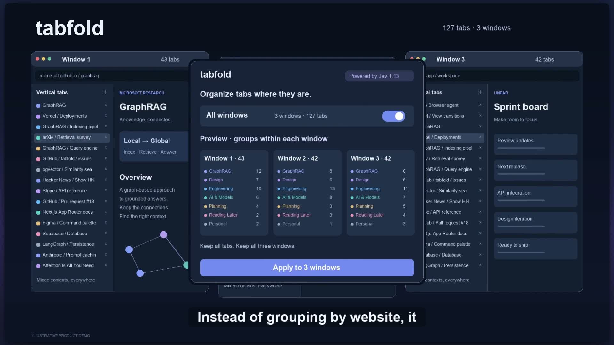

<div align="center">

# Tabfold

**減少分頁干擾，騰出思考空間。**

將擁擠的 Chrome 視窗整理成清楚、可收合的分頁群組 — **任何變更前都能先預覽**。

**預覽 → 檢查 → 套用**

Chrome Manifest V3 · 本機優先 · Jev 1.13 · 無執行階段相依套件

[English](../README.md) · [Français](README.fr.md) · [한국어](README.ko.md) · [简体中文](README.zh-CN.md) · [繁體中文](README.zh-TW.md) · [Русский](README.ru.md) · [日本語](README.ja.md) · [Türkçe](README.tr.md) · [Español](README.es.md)


</div>

[](../docs/assets/tabfold-demo.mp4)

**[▶ 觀看 25 秒示範](../docs/assets/tabfold-demo.mp4)**

Jev 協助依脈絡將分頁分群。先預覽，再套用：各視窗內分別整理，不合併視窗。

*英語旁白 · 示意展示，並非實際螢幕錄影。*

## 為什麼選擇 Tabfold

- **先預覽** — Tabfold 變更分頁前，先查看建議的群組。
- **不使用 AI 也能運作** — 不需要 API 金鑰，使用標題的 TF-IDF 與餘弦相似度進行保守分群。
- **需要時再用 AI** — 透過 OpenRouter 或 TypeSafe 使用 Jev，進行更智慧的分類。
- **保留工作脈絡** — 分頁留在原本的視窗中，只收合群組以減少雜亂。
- **預設保護分頁** — 已固定、正在播放音訊、無痕、瀏覽器內部及已分組的分頁都受到保護。
- **輕鬆復原** — 復原上一次分組，並還原清理重複分頁時移除的網址。


## 使用方式

1. 使用本機分群或 AI **預覽**。
2. **檢查**建議的群組。
3. 確認結果後**套用**。

就是這麼簡單。Tabfold 會分組並收合分頁，不合併視窗，也不取代你的頁面。

執行 AI 前即可查看現有群組。保留模式將符合條件的分頁加入同一視窗的群組，不改變原有成員及外觀。其他視窗中有名稱的分類可在目前視窗建立獨立的新群組，分頁不會跨視窗移動。重新分組會參考有名稱群組的用途來重建成員；僅以主機名稱命名的群組不會作為分類範本。

已固定、正在播放音訊、無痕及內部分頁仍受保護。只套用建議的群組，新群組至少需要兩個分頁，未符合條件的單一分頁保留原位。復原時盡可能還原原群組，但不保證精確還原分頁順序。

快速預覽使用標題的 TF-IDF、餘弦相似度與完全連結法（complete-link）進行保守分群。不使用嵌入或預先訓練的神經網路，也不下載模型或請求伺服器。唯一的固定分類規則是依副檔名將圖片歸入 **Images**；不依網站或主題預設對應分類。

彈出視窗可分別設定重新分群、忽略已儲存分類、使用現有群組名稱與新分類建議。AI 判斷不確定時，分頁維持未分類，不以詞彙分群取代。啟用現有群組名稱時，可能傳送名稱、說明、範例標題與不含查詢參數的 URL。新群組建議屬於實驗功能，不保證準確，請在接受或套用前檢查。

**使用現有群組名稱**預設開啟；關閉並啟用重新分組即可不參考原有群組重新開始，與**忽略已儲存的分類**相互獨立；關閉時不傳送現有群組中繼資料或範例，但參與分類的分頁標題與 URL 仍會傳送給 AI。

## 安裝

1. 下載或複製此儲存庫。
2. 開啟 `chrome://extensions`。
3. 啟用**開發人員模式**。
4. 按一下**載入未封裝項目**，選擇 `extension` 資料夾。
5. 將 **Tabfold** 固定到工具列。

不需要建置或安裝套件。

## 依照習慣調整

在**設定**中，你可以：

- 建立最多 **12 個自訂分類**
- 選擇按**目前順序／標題／最久未使用**排列分頁
- 在新增前檢查建議的新主題
- 以 JSON 匯入或匯出分類
- 切換英文、法文、韓文、簡體中文、繁體中文、俄文、日文、土耳其文及西班牙文

「其他」分類會自動處理。

## AI 是選用功能

本機預覽完全在瀏覽器中進行。

若要使用 AI 預覽，請在**設定 → AI 連線**中選擇 **OpenRouter** 或 **TypeSafe**，並新增該供應商的 API 金鑰。

啟用**新群組建議**時，OpenRouter 使用 GPT-4.1 產生名稱與分類條件，再以 Jev 分類分頁。新群組僅用於這次預覽，不會修改已儲存的分類，可能產生額外呼叫與費用。TypeSafe 直接連線僅使用 Jev，不會自動切換至 OpenRouter。

- OpenRouter 使用 Jev 分類，使用 GPT-4.1 產生新群組名稱，可能需要額外的 API 呼叫。
- TypeSafe 使用 **Jev 1.13**
- API 金鑰儲存在 Chrome 的**工作階段儲存空間**中，關閉瀏覽器後就會清除
- **不會自動改用其他供應商**

## 隱私

| | |
|---|---|
| **本機預覽** | 不對外傳送資料 |
| **AI 預覽** | 傳送分頁標題、網址來源／路徑及分類條件 |
| **絕不傳送** | 頁面內文、網址認證資訊、查詢字串、片段識別碼 |
| **API 金鑰** | 僅保存在目前工作階段 |
| **分析／廣告** | 無 |

標題與網址路徑仍可能含有敏感資訊。詳情請參閱[隱私說明](../docs/PRIVACY.md)。

## 開發

需要 **Node.js 22+**。

```bash
npm test
npm run check
```

使用原生 JavaScript 和 Chrome API，沒有執行階段相依套件，也沒有遠端程式碼。

[驗證紀錄](../docs/VALIDATION.md) · [發布說明](../docs/LAUNCH.md) · [分類 JSON 範例](../docs/categories.example.json)

---

**收合僅是視覺上的整理，不會摘要內容，也不保證降低記憶體用量。**
